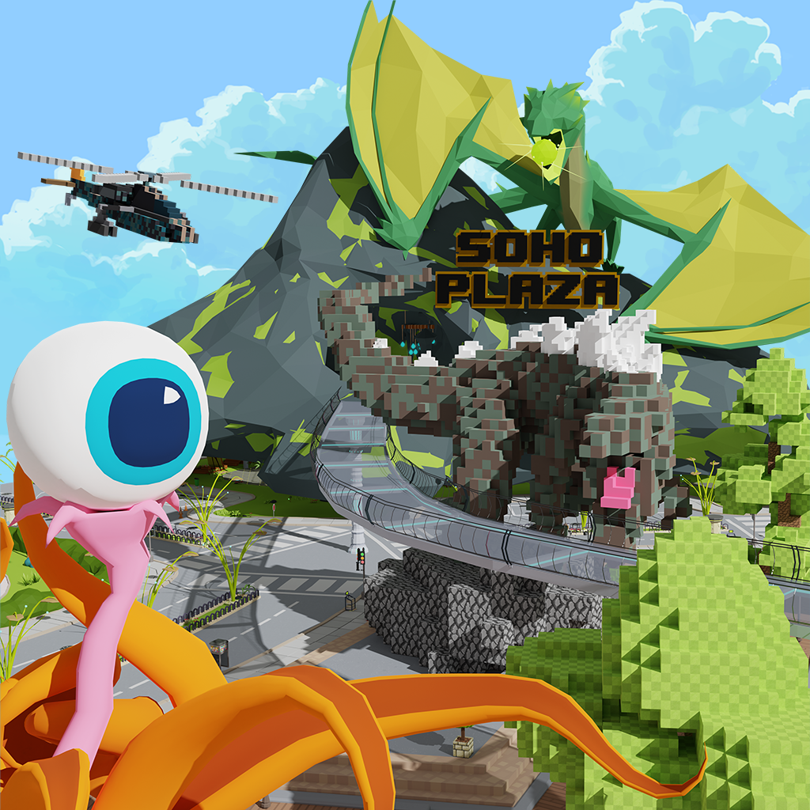

# Soho-Plaza

The full Soho Plaza.



This scene contains a lot of useful mechanics, including:

- Fetching data from APIs
- Adding teleports to other scenes
- Adding external links outside Decentraland
- Syncing player actions with the messagebus
- Streaming audio
- Streaming video
- Displaying a custom UI

Because it can be hard to find specific things in such a large repository, some of the most interesting bits of the scene have been exported into their own example repos:

- [3D Voxel Art Creator](https://github.com/decentraland-scenes/voxel-art-creator): Create 3D voxel art by placing cubes in place. Players are synced through both the messagebus and a DB in a server.
- [Wearables Scanner](https://github.com/decentraland-scenes/wearables-scanner): Fetch the list of wearables that a player currently has on. If they have something in the eyewear category, open the door for them.
- [Block Fountain](https://github.com/decentraland-scenes/Block-Fountain): The cubes in this fountain have several animations that each set can play. When a player pushes a button, all players see the same animation.
- [NFT](https://github.com/decentraland-scenes/Certified-criptokitty): Display a 2D NFT in a picture frame.
- [Piano Floor](https://github.com/decentraland-scenes/piano-floor-example-scene): Play the keys of this piano by stepping on them. All players will hear the notes that are played.
- [Zenquencer](https://github.com/decentraland-scenes/Zenquencer): Create musical patterns that are played in sequence. Players are synced through both the messagebus and a DB in a server.

## Try it out

**Install the CLI**

Download and install the Decentraland CLI by running the following command:

```bash
npm i -g decentraland
```

**Previewing the scene**

Download this example and navigate to its directory, then run:

```
$:  dcl start
```

Any dependencies are installed and then the CLI opens the scene in a new browser tab.

**Setting up the server**

The scene is set up to make use of the same server that's used by Soho Plaza. To launch your own server, we recommend you deploy what's in the `/server` folder to your own Firebase account, following the steps in [this tutorial](https://decentraland.org/blog/tutorials/servers-part-2/). To store data on an Amazon S3 server, as done here, you'll also need to set up your own Amazon S3, and fetch credentials for that account to include in your server folder.

Learn more about how to build your own scenes in our [documentation](https://docs.decentraland.org/) site.

If something doesn’t work, please [file an issue](https://github.com/decentraland-scenes/Awesome-Repository/issues/new).

## Copyright info

This scene is protected with a standard Apache 2 licence. See the terms and conditions in the [LICENSE](/LICENSE) file.
